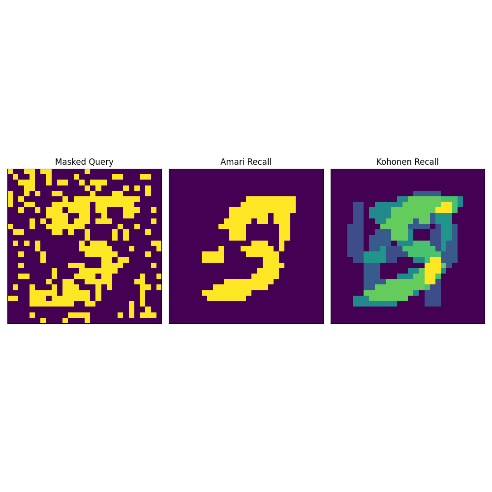
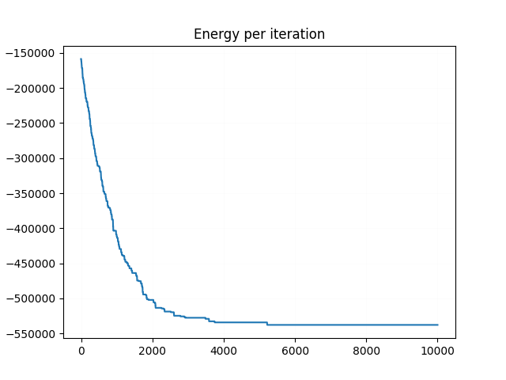
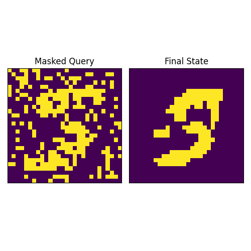
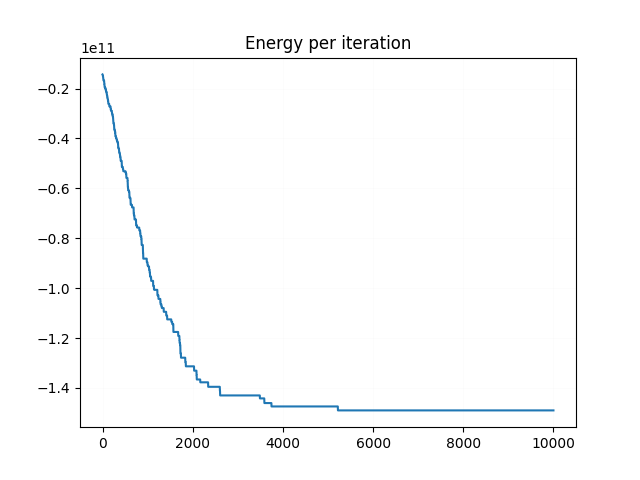
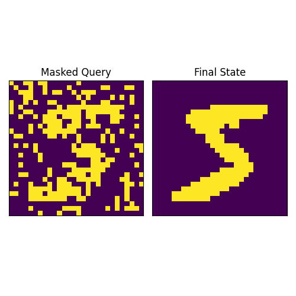

# energy-based-am-presentation

Code and figures for my lab presentation on Energy-based Associative memories.
Implementation of Energy-based Associative Memories comes from [Krotov et al. (2025)](https://tutorial.amemory.net/).
Please check out this tutorial and associated notebooks. It is very wonderful.

# Figures

The following figures are generated

## Correlation Matrix Associative Memories



## Classical Hopfield Energy





## Minerva2





# Installation and Hacking

Download and install [`uv`](https://docs.astral.sh/uv/)

Enter into the cloned repository, and run the following command:
```sh
$ uv sync
```

To generate the figures, run
```sh
$ uv run main.py
```